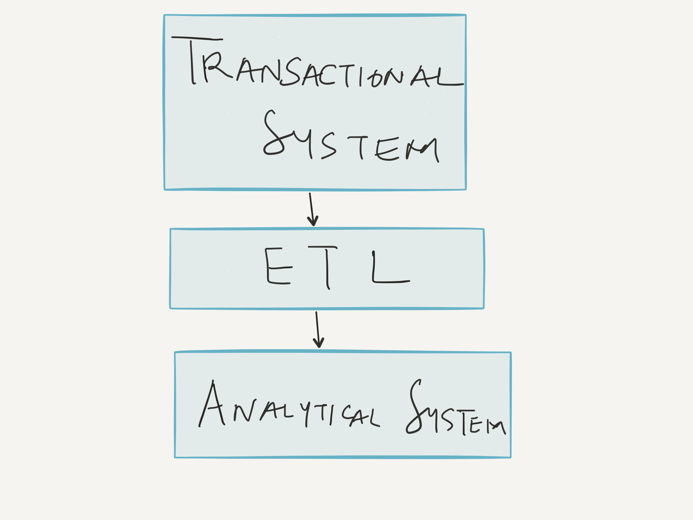
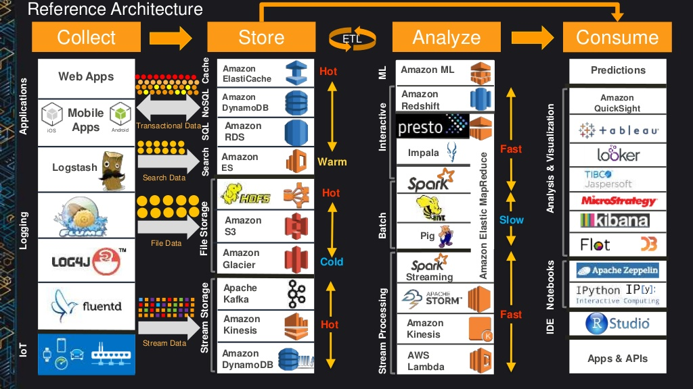

# [fit] AWS Big Data Stack

### Episode #1: Architectural Overview

   

   

##### © Badar Ahmed, 2016. [thebigdatastack.com](thebigdatastack.com)

^ Hello & Welcome to the AWS Big Data Stack Screencast Series. I am your host Badar Ahmed.

^ This is Episode #1!

---

# [fit] Architecture

 

^ In this episode, we are going to outline the architecture for the rest of this series. This should give you a good high level understanding of the content that we are going to be convering in this screencast series. 

^ So let's get started!

---

# What does AWS Big Data Stack mean?

^ We have titled this screencast series 'AWS Big Data Stack', so I want to explain what we mean by the term 'Big Data Stack'.

___

# What does AWS Big Data Stack mean?

^ By 'big data' we mean systems that can scale well with high volume, velocity or variety of data.

^ By the term 'stack', we mean we are not talking about a particular big data system or technology but instead a whole slew of technologies that fit different purposes. 

^ We are going to discuss how to design a scaleable architecture that can handle big data using AWS technologies, across the stack.

---

# AWS Reference Architecture[^1]

^ So let's take a look at the high level components of the AWS Big Data Stack and how different technologies fit into this architecture.

___

# AWS Reference Architecture

___

## Architecture for this Screencast Series?

 

___

^ Why we chose DynamoDB?

^ Why we chose Lambda?

^ Why we chose Spark?

^ Why we chose Redshift

___

# Application, DB, Streaming

- Application/API
- Highly scaleable NoSQL Database
- Decoupled design with a Stream
- Stream Processing (3rd Party Integration)

___

# Analytics

- ETL
- Data Lake
- Batch Analysis
- Realtime Analysis
- Datawarehouse
- Interactive analysis using Datawarehouse

___

# Advanced Topics

- Data Analysis using Notebook Environment  

- Design Data Pipelines with Automation
- Datawarehouse Management

___

# Thanks! :tada:

#### For more checkout **[thebigdatastack.com](https://thebigdatastack.com)**

#### Make sure to signup for free membership

[^1]: `Big Data Architectural Patterns and Best Practices on AWS`   [`http://www.slideshare.net/AmazonWebServices/bdt310-big-data-architectural-patterns-and-best-practices-on-aws`](http://www.slideshare.net/AmazonWebServices/bdt310-big-data-architectural-patterns-and-best-practices-on-aws)

